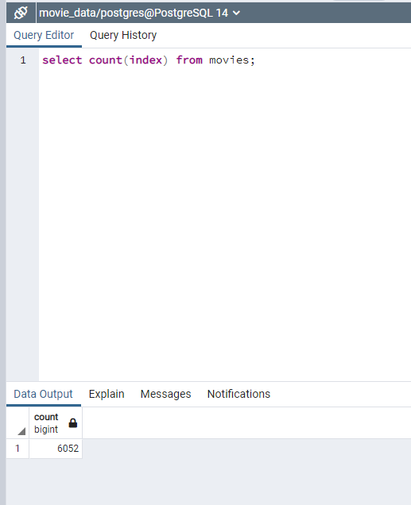
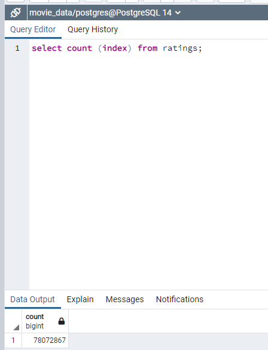

# Movies-ETL Overview

### The purpose for this challenge was to import three CSV files, manufacture the data in a workable format, uploading into  Postgres dbo, and run simultaneously. 

# Resources

### The three data files used in the analysis were:

* Movies_metadata.csv
* ratings.csv
* wikipedia-movies.json

# Summary
The two visuals below show the final end product in the SQL database. 

